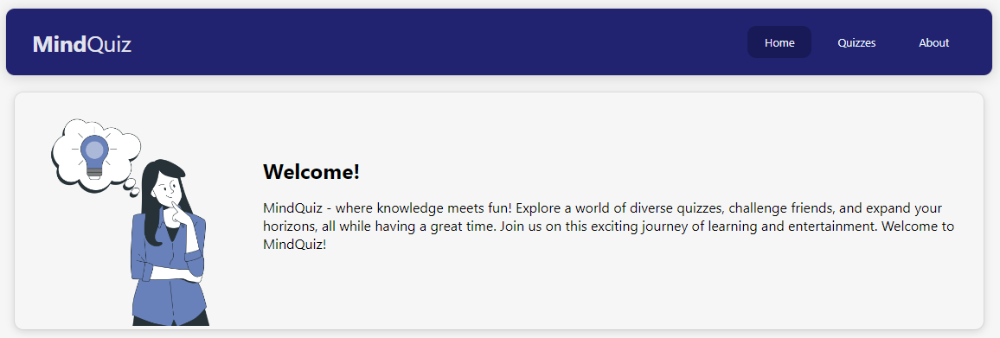
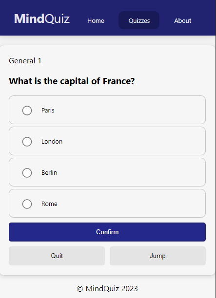
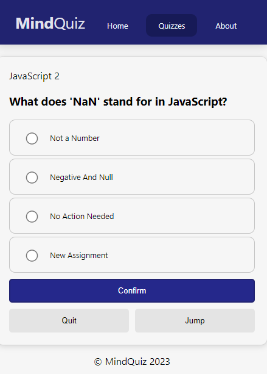
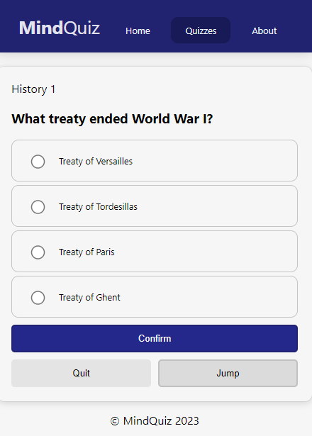

# MindQuiz

> Uma plataforma de Quizzes variados e facilmente atualiázeis por JSON.

'

### Ajustes e melhorias

-   [x] Abastecimento por JSON;
-   [ ] Configurações para o usuário;
-   [ ] Modos Competitivos;

### Linguagens e Tecnologias

### Autoria

<table>
<tr>
<td width="25%" align="center">
<a href="https://github.com/romhenri">
 

<b>Rômulo Henri</b>

</a>
</td>
<td width="75%" align="center">

Projeto desenvolvido para Estudar e Praticar o uso de React com JSONs e React Router DOM. Além disso, usar os quizzes para revisão de conteúdos.

<!--   -->
Iniciado: Dia 20, de Setembro (2023)
</td>
</tr>
</table>
